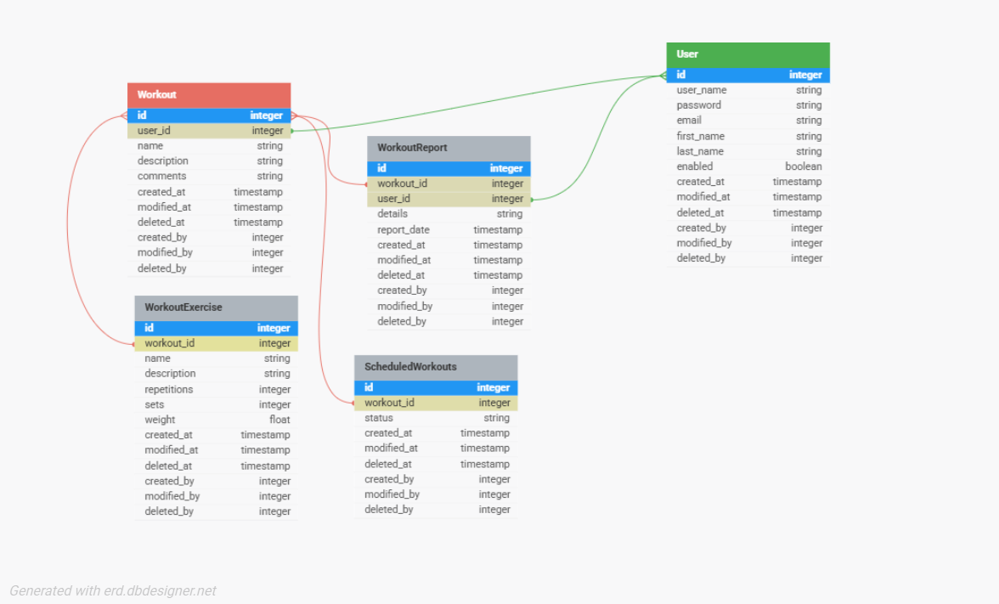

# 🏋️ Go Hexagonal Workout Tracker

A professional fitness workout tracker built with Go using **Hexagonal Architecture** (Ports & Adapters pattern). This project provides a clean, scalable, and maintainable solution for tracking workouts, exercises, and fitness progress.

> **Project Inspiration**: This project is based on the [Fitness Workout Tracker](https://roadmap.sh/projects/fitness-workout-tracker) project idea from roadmap.sh

## 🚀 Features

### Core Functionality
- **Workout Management**: Create, update, delete, and organize workout routines
- **Exercise Tracking**: Detailed exercise logging with sets, reps, and weights
- **Scheduled Workouts**: Plan and schedule workouts with status tracking
- **Workout Reports**: Generate detailed reports and analytics
- **User Authentication**: Secure JWT-based authentication system
- **Resource-based Access Control**: Users can only access their own data

### Technical Features
- **Clean Architecture**: Hexagonal/Ports & Adapters pattern implementation
- **RESTful API**: Comprehensive REST API with Swagger documentation
- **Database Integration**: PostgreSQL with GORM ORM
- **Comprehensive Testing**: Unit tests for handlers, use cases, and repositories
- **Rate Limiting**: Built-in API rate limiting for security
- **Middleware Support**: Authentication, logging, and CORS middleware
- **Docker Support**: Containerized deployment ready

## 🏗️ Architecture

This project follows the **Hexagonal Architecture** pattern, providing clear separation of concerns:

```
src/
├── cmd/                    # Application entry points
├── internal/               # Private application code
│   ├── user/              # User domain
│   ├── workout/           # Workout domain
│   └── middlewares/       # HTTP middlewares
├── pkg/                   # Shared packages
├── docs/                  # API documentation & database diagrams
├── migrations/            # Database migrations
└── docker/               # Docker configurations
```

### Domain Structure (Hexagonal Architecture)
```
internal/workout/
├── core/                  # Business logic (Domain)
│   ├── models/           # Domain entities
│   ├── usecase/          # Business use cases
│   └── ports/            # Interfaces (ports)
├── adapter/              # External adapters
│   ├── http/             # HTTP handlers & DTOs
│   └── repository/       # Database repositories
└── test/                 # Comprehensive test suite
```

## 📊 Database Schema

The application uses a well-designed PostgreSQL database with the following main entities:

- **Users**: User authentication and profile management
- **Workouts**: Main workout routines
- **WorkoutExercises**: Individual exercises within workouts
- **ScheduledWorkouts**: Planned workout sessions with status tracking
- **WorkoutReports**: Detailed workout completion reports



## 🛠️ Technology Stack

- **Language**: Go 1.22.2
- **Framework**: Gin Web Framework
- **Database**: PostgreSQL with GORM ORM
- **Authentication**: JWT tokens
- **Documentation**: Swagger/OpenAPI 3.0
- **Testing**: Go testing with comprehensive test coverage
- **Rate Limiting**: Tollbooth middleware
- **Configuration**: Viper for configuration management
- **Containerization**: Docker

## 🚦 Getting Started

### Prerequisites
- Go 1.22.2 or higher
- PostgreSQL 12+
- Docker (optional)

### Installation

1. **Clone the repository**
   ```bash
   git clone https://github.com/alielmi98/go-hexa-workout.git
   cd go-hexa-workout
   ```

2. **Install dependencies**
   ```bash
   cd src
   go mod download
   ```

3. **Set up environment variables**
   Create a `.env` file in the `src` directory:
   ```env
   DB_HOST=localhost
   DB_PORT=5432
   DB_USER=your_username
   DB_PASSWORD=your_password
   DB_NAME=workout_tracker
   JWT_SECRET=your_jwt_secret
   PORT=8080
   ```

4. **Run database migrations**
   ```bash
   go run cmd/server/main.go
   ```

5. **Start the server**
   ```bash
   go run cmd/server/main.go
   ```

The API will be available at `http://localhost:8080`

### Using Docker

1. **Build and run with Docker Compose**
   ```bash
   docker-compose up --build
   ```

## 📚 API Documentation

The API is fully documented using Swagger/OpenAPI 3.0. Once the server is running, you can access:

- **Swagger UI**: `http://localhost:8080/swagger/index.html`
- **OpenAPI JSON**: `http://localhost:8080/swagger/doc.json`
- **OpenAPI YAML**: Available in `src/docs/swagger.yaml`

### Main API Endpoints

#### Authentication
- `POST /api/v1/auth/register` - User registration
- `POST /api/v1/auth/login` - User login

#### Workouts
- `GET /api/v1/workouts` - Get user's workouts (with filtering)
- `POST /api/v1/workouts` - Create new workout
- `GET /api/v1/workouts/{id}` - Get workout by ID
- `PUT /api/v1/workouts/{id}` - Update workout
- `DELETE /api/v1/workouts/{id}` - Delete workout

#### Workout Exercises
- `POST /api/v1/workouts/{workoutId}/exercises` - Add exercise to workout
- `GET /api/v1/exercises/{id}` - Get exercise by ID
- `PUT /api/v1/exercises/{id}` - Update exercise
- `DELETE /api/v1/exercises/{id}` - Delete exercise

#### Scheduled Workouts
- `POST /api/v1/scheduled-workouts` - Schedule a workout
- `GET /api/v1/scheduled-workouts/{id}` - Get scheduled workout
- `PUT /api/v1/scheduled-workouts/{id}` - Update scheduled workout
- `DELETE /api/v1/scheduled-workouts/{id}` - Delete scheduled workout

#### Workout Reports
- `POST /api/v1/workout-reports` - Create workout report
- `GET /api/v1/workout-reports/{id}` - Get workout report
- `PUT /api/v1/workout-reports/{id}` - Update workout report
- `DELETE /api/v1/workout-reports/{id}` - Delete workout report

## 🧪 Testing

The project includes comprehensive test coverage for all layers:

### Run Tests
```bash
cd src
go test ./...
```

### Test Coverage
```bash
go test -cover ./...
```

### Test Structure
- **Handler Tests**: HTTP endpoint testing with mock dependencies
- **Use Case Tests**: Business logic testing with repository mocks
- **Repository Tests**: Database interaction testing
- **Integration Tests**: End-to-end API testing

## 🔒 Security Features

- **JWT Authentication**: Secure token-based authentication
- **Resource-based Access Control**: Users can only access their own data
- **Rate Limiting**: Protection against API abuse
- **Input Validation**: Comprehensive request validation
- **SQL Injection Protection**: GORM ORM with parameterized queries
- **CORS Support**: Configurable cross-origin resource sharing

## 🏗️ Architecture Benefits

### Hexagonal Architecture Advantages
- **Testability**: Easy to mock external dependencies
- **Maintainability**: Clear separation of business logic from infrastructure
- **Flexibility**: Easy to swap out adapters (database, web framework, etc.)
- **Domain-Driven Design**: Business logic is isolated and protected
- **Dependency Inversion**: Core business logic doesn't depend on external frameworks

### Code Organization
- **Domain Models**: Pure business entities without external dependencies
- **Use Cases**: Business logic implementation with clear interfaces
- **Adapters**: External integrations (HTTP, Database) implementing core interfaces
- **Dependency Injection**: Clean dependency management throughout the application

## 🤝 Contributing

1. Fork the repository
2. Create a feature branch (`git checkout -b feature/amazing-feature`)
3. Commit your changes (`git commit -m 'Add some amazing feature'`)
4. Push to the branch (`git push origin feature/amazing-feature`)
5. Open a Pull Request

### Development Guidelines
- Follow Go best practices and conventions
- Maintain test coverage above 80%
- Update documentation for new features
- Follow the existing hexagonal architecture patterns

## 📝 License

This project is licensed under the MIT License - see the [LICENSE](LICENSE) file for details.

## 🙏 Acknowledgments

- [roadmap.sh](https://roadmap.sh/projects/fitness-workout-tracker) for the project inspiration
- Go community for excellent tooling and libraries
- Hexagonal Architecture pattern for clean code structure

## 👨‍💻 Author

**Ali Elmi** - [@alielmi98](https://github.com/alielmi98)

---

⭐ If you find this project helpful, please give it a star on GitHub!
